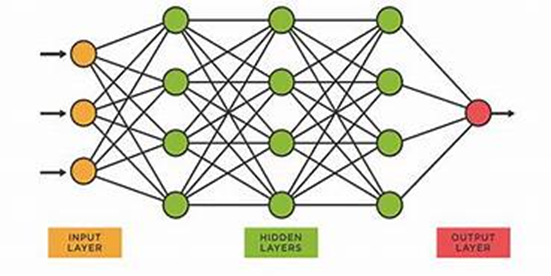

# **NEURAL NETWORKS**
## Neural Networks form the base of Deep Learning, which is one of the components of Machine Learning. They take in the data, study the data that is identify the patterns in the data and predict the output for a set of similar data.
## They are made up of Neurons which form the core processing unit of these networks and they learn by example. They mainly consists of 3 layers: Input, Hidden and the output layer. The input layer mainly takes the input, the data pre-processing takes place in the hidden layers and the output layer delivers the output.
## Image is mainly taken in the form of pixels and is fed into the input layer. Neurons of each layer are interconnected to each other through channels and each channel is associated with a weight. This weight is then multiplied with each of the input and their sum is sent as input to the neurons of the next layer. The neurons of next layer, would have fixed numerical values called bias. The bias is added to the sum. This is then passed through threshold function called-Activation Function.
## The activation function further tells whether the neuron would be activated or not. The activated neuron transmits the data to other neurons of next layer over channels. This is called Forward Propagation.  In the output layer, the neuron with the highest values predicts the output. This output is then compared to the actual output and the error is noted. The feedback and changes to be made is sent back to the input layer.
## This is called Backward Propagation. This process is continued, until the model predicts the right output. Neural networks are used in Facial Recognition, Music Composition and Forecasting
## 
## Types of Neural Network:
- ## ANN(Artificial Neural Network) : 
     ## This network has multiple neurons on each lay
     ## Input is transmitted in only one direction.
     ## They may or may not have hidden layers.
     ## Can work with incomplete data and store info on entire network.
     ## They offer fault tolarency.
- ## CNN(Convolutional Neural Network):   
    ##  Multi-layer of neurons either entirely connected or pooled.

    ## They create feature maps that record a specific region of image.
 
    ## They provide High Accuracy.

    ## They are very efficient in features detection, but a lot of training data is required for their accuracy.

- ## RNN(Recurrent Neural Network)
     ## These networks are complex. They save the output of the pre-processing nodes and feed them back into the model, thus transmitting info in both the directions. 

     ## Each node here acts as a memory cell, if the system predicts wrong output the system self-learns during Backward Propagation. RNN remembers each and every information.

     ## Training the network here is a difficult task and is prone to gradient variations.

  

